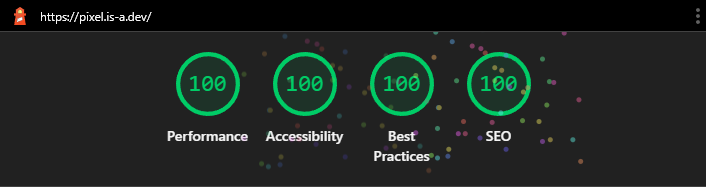

# basicpixel.github.io

This repository contains the source code for my personal website - portfolio.

[Check it out here](https://basicpixel.github.io)

### Tech stack

- Next.js
- TailwindCSS
- framer-motion for page transitions
- Notion as a CMS for the blog
- react-markdown to display blog post contents
- Nord color pallete
- next-sitemap
- Hosted on GitHub pages

### Special Thanks to:

- [is-a.dev](https://github.com/is-a-dev/register) for providing a free subdomain.
- [favicon.io](https://favicon.io) for helping me create a favicon.
- [Github Pages](https://pages.github.com/) for hosting the website.
- [This video](https://youtu.be/yRz8D_oJMWQ) for helping me host Next.js on GH Pages.
